

# Overview

> **TSContactForm** is a <a href="https://www.google.com/script/start/" target="_blank">Google Apps Script</a> for <a href="https://support.google.com/docs/topic/6063584" target="_blank">Google Forms</a> which automatically emails the form owner each time a user submits a response to the form.  Emails are nicely formatted and contain the content of the form submission.  

For example, the following image shows a simple form ***created with <a href="https://support.google.com/docs/topic/6063584" target="_blank">Google Forms</a>***

	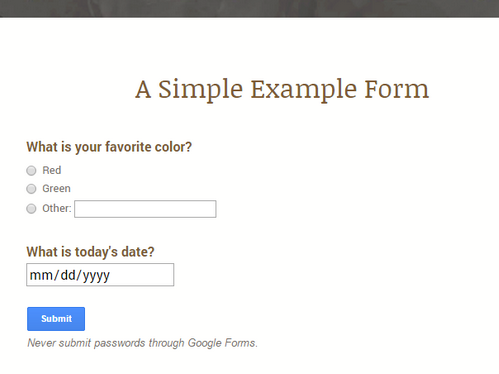

 

... and a view of an email form submission ***generated and sent by TSContactForm***

	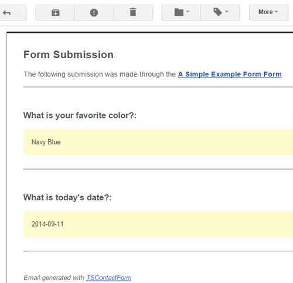

<h4>Important!</h4>

<ul>
<li>For **TSContactForm** to run, a *form submit trigger* must be enabled through the ***TSContactForm*** menu once the script is installed.  *See the __[QuickStart](#quickstart)__ section below for more information.*</li> 
</ul>

---

# Install

There are ***two methods*** available for installing **TSContactForm**.

<h4>Method #1: Easy install with TSScriptCopy</h4>

**TSScriptCopy** is an application which ***automates the process of copying files to your Google Drive***.  

<em>NOTE: The TSScriptCopy application and its use are licensed under <a href="http://www.apache.org/licenses/LICENSE-2.0.html" target="_blank">Apache License, Version 2.0</a></em>

Follow these instructions to install the ***TSContactForm script and host form*** into your Google Drive ***with TSScriptCopy***:  

 

**Step 1:**  Login to your **<a href="http://drive.google.com/" target="_blank">Google Drive</a>**      

 

**Step 2:**  Click **<a href="https://script.google.com/macros/s/AKfycbyvyOdWanBy-3ovr_YirIK9gNR-EYkpdYtbROPi7qgrpABO7H09/exec" target="_blank">TSScriptCopy</a>** to access. ***Wait for the application to load...***    

 

*(If you have not run __TSScriptCopy__ before, you will be prompted to perform a __one-time authorization__ to allow the application to copy scripts and host documents to your Google Drive.)*

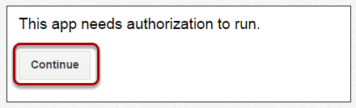

 

**Step 3:**  When the ***TSScriptCopy*** page displays in your browser, locate the **_TSContactForm_ Copy to Drive** button and ***click*** to install 

   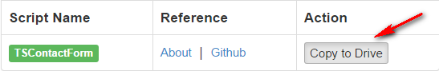

 

**Step 4:** Wait for **TSScriptCopy** to copy the ***TSContactForm script and host form*** to your Google Drive.  *The copy process may take a minute to run...* 
 

	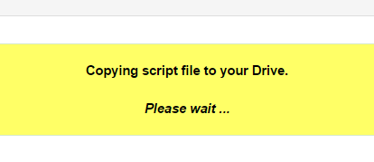

 

**Step 5:** Access and open ***the TSContactForm host form*** by clicking the link in the resulting notification message.  

	

*(Click the __Close__ link to close the notification...or exist __TSScriptCopy__ by closing the associated browser window.)*

 

**Step 6:** To use the script, see the **[Quick Start](#quickstart)** section below.

<h4>Method #2: Manual Install</h4>

See the **<a href="https://github.com/techstreams/TSContactForm" target="_blank">TSContactForm project on Github</a>** for code and manual install instructions.

---

# Quick Start

> Get started with **TSContactForm** in ***three easy steps***:  

 

<h4>Step 1: Enable TSContactForm</h4>

Locate *(and open)* the ***Google Form*** created during **[Install](#install)**.    

 

Find the **TSContactForm** menu option in the form toolbar.

	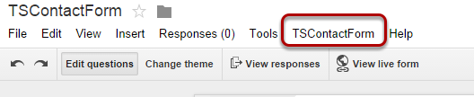

 

Select the ***TSContactForm*** > ***Enable Submit Trigger*** menu option. 

	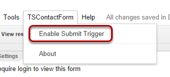

  

*(If you have not run __TSContactForm__ before, you will be prompted to perform a __one-time authorization__ to allow the script access.  Follow the prompts to authorize.)*

	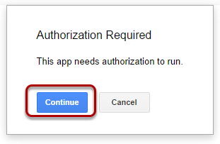

	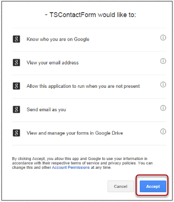

 

**Once the script trigger is enabled** a notification message will show.  *Click __OK__ to dismiss the message.*

	

 

<h4>Step 2: Modify Form</h4> 

Modify the ***Google Form***...*see the __<a href="https://support.google.com/docs/answer/2839737" target="_blank">documentation</a>__ for more help.*  

<ul>
	<li>Add form items using the **Add item** button</li>
	<li>Edit the ***form title, form description, ...***</li>
	<li>Add or customize the __<a href="https://support.google.com/docs/answer/145737" target="_blank">form theme</a>__</li>
</ul> 

 

	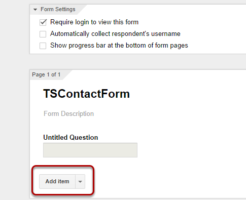

 

<h4>Step 3: Publish Form</h4> 

View the ***live form*** by clicking the **View live form** button on the form toolbar.  

 

*__The form is now ready to share with others__...see the __<a href="https://support.google.com/docs/answer/2839588" target="_blank">form sharing documentation</a>__ for more information.*

	

---

**GOOGLE APPS USERS ONLY:**  

 

To publish the form, ***uncheck*** the ***Require login to view this form*** box at the top of the form and click **OK** on the following prompt.  

	

 

***If you wish to keep the form accessible only within your Google Apps domain:***  

<ul>
	<li>Leave the ***Require login to view this form*** checked</li>
</ul>

	

 
 

***If you wish to keep the form accessible only within your Google Apps domain AND collect the respondent’s username:***  

<ul>
<li>Check the ***Automatically collect respondent’s username*** box.  *The form submission email will contain the respondent’s username in addition to the form submission content.*
</ul>

	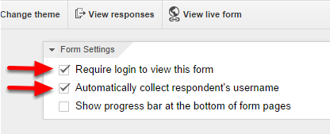

<h4>Important Notes About TSContactForm:</h4>
<ul>
	<li>Google Apps Scripts are subject to ***daily quota limits*** including the number of emails sent. See the ***Quota Limits*** tab of the **<a href="https://docs.google.com/macros/dashboard" target="_blank">Google Apps Script Dashboard</a>** for more information.</li>
</ul>
<ul>
	<li>**TSContactForm** may not be appropriate for high traffic forms, especially in cases where the form owner consistently receives ***quota limit exceeded*** notifications.</li>
</ul>

